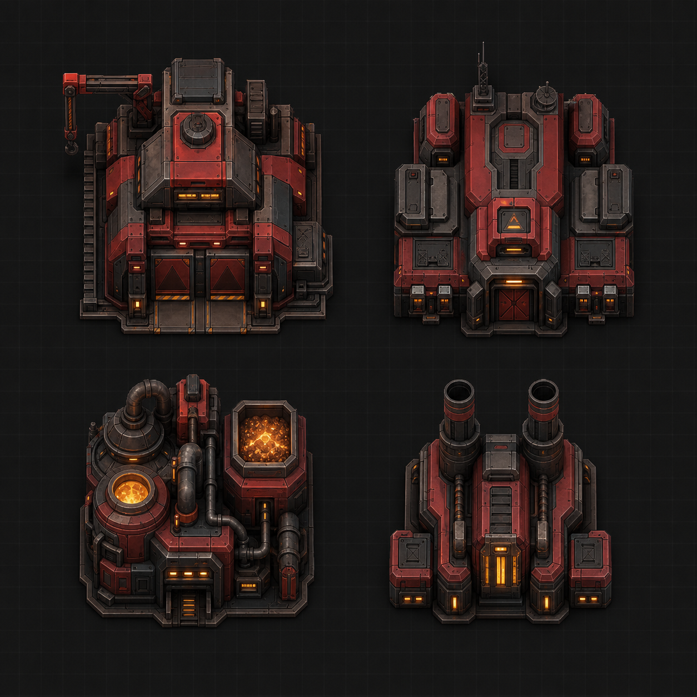
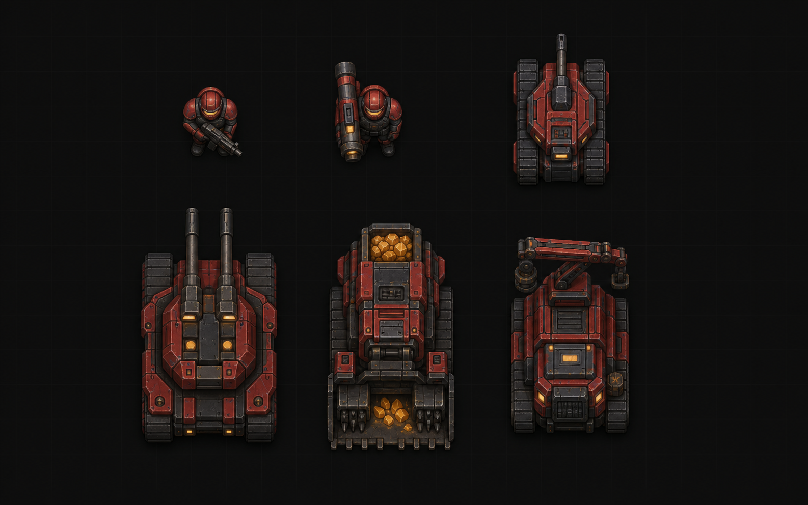
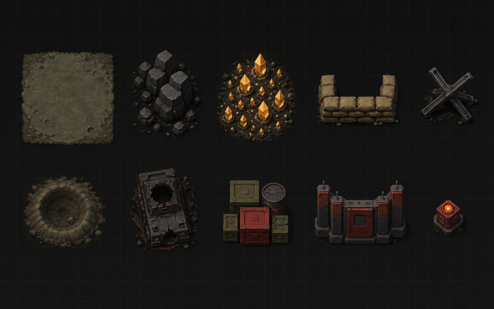

# 赤色前线：黎明协议

一款可直接在浏览器运行的**原创**即时战略游戏（RTS）。基地建设、资源采集、部队生产、分批攻防——完整复刻经典 RTS 的核心循环。所有名称、阵营、单位、美术、音效均为原创：单位、建筑和战场素材均以项目内透明 PNG 加载，音效由 WebAudio 振荡器实时合成，不含任何第三方游戏资产。

## 美术素材预览

游戏采用高位正俯视的原创战场美术，统一使用红色装甲、炭黑钢结构、暖琥珀识别灯和低饱和荒原配色。以下是第一轮素材概念设计；已经拆分并接入游戏的透明 PNG 位于 [`src/assets/generated/`](src/assets/generated/)。

### 阵营建筑

兵工厂、兵营、资源精炼厂与发电站：



### 作战单位

步兵、火箭兵、轻型坦克、重型坦克、采矿车与基地工程车：



### 战场地形与设施

岩石、矿物、沙袋、拒马、弹坑、残骸、补给箱、防御墙与警示灯：



详细的美术规范与落地尺寸见 [`design/asset-concepts/README.md`](design/asset-concepts/README.md)。

## 技术栈

- **Phaser 3** — 游戏渲染与主循环
- **TypeScript** — 全量类型化源码
- **Vite** — 开发服务器与构建
- **puppeteer-core**（仅开发依赖）— 自动化冒烟试玩脚本

## 快速开始

```bash
npm install
npm run dev        # http://localhost:5173
```

其他命令：

```bash
npm run build      # 产物输出到 dist/
npm run typecheck  # TypeScript 类型检查
npm run smoke      # 自动化试玩测试（需本机装有 Chrome，且 dev server 已启动）
```

## 玩法

### 目标

摧毁敌方**指挥中心**即获胜；己方指挥中心被摧毁则战败。

### 开局

你只有一辆**基地工程车**。左键选中它，按 `F`（或点击底部“部署”按钮）将其部署为**指挥中心**，然后围绕它建设基地。敌方 AI 在地图对角拥有一座已运转的基地，会采矿、建造、扩军，并一波接一波地发动进攻——波次越往后规模越大、重装越多。

### 操作

### 操作（Mac）

| 操作 | 说明 |
| --- | --- |
| 点按 | 选择单位 / 建筑，拖动则框选 |
| ⇧ Shift + 点按 | 追加选择 |
| 双指轻点触控板 / ⌃ Ctrl + 点按 | 移动；点到敌人身上则攻击；点到矿区则指挥采矿车开采 |
| 选中兵营/战车工厂后同上操作 | 设置集结点：新单位出厂后自动前往并**蹲守**（绿色旗标，遇敌迎战、追远即回） |
| 双指滑动 | 缩放地图 |
| `F` | 部署选中的基地工程车 |
| `H` | 打开 / 关闭游戏内说明面板（开局自动显示，含难度选择） |
| `Esc` | 取消建造放置 / 取消选择 |
| 方向键 / WASD / 鼠标贴边 | 卷动地图 |
| 雷达在线时点击 / 拖动地图 | 快速跳转视野 |

### 难度

开局说明面板可选 **简单 / 普通 / 困难**（游戏中按 `H` 可调），影响 AI 初始资金、决策频率、进攻波次规模与重坦登场时间。

### 地图

一张 64×64 格的原创战场：双方基地沿主对角线布于地图中部两侧，中央为争夺区与富矿带，岩石地形不可通行。

### 建筑

| 建筑 | 作用 |
| --- | --- |
| 指挥中心 | 基地核心，提供少量电力，被摧毁即战败 |
| 发电站 | 提供电力 |
| 资源精炼厂 | 接收矿石变现，**完工附赠一辆采矿车** |
| 兵营 | 训练步兵、火箭兵 |
| 战车工厂 | 生产轻型/重型坦克、采矿车、基地工程车 |
| 防御塔 | 自动攻击射程内敌人，电力不足时瘫痪 |

建造有**范围限制**（必须贴近己方建筑），并有**前置科技**要求（如战车工厂需要先建精炼厂）。

### 经济与电力

- 采矿车全自动运行：寻矿 → 开采 → 返回精炼厂 → 变现入账；矿脉会枯竭。
- 建筑耗电、电站供电；**电力不足时生产速度减半、防御塔停摆**，顶部电力指示会变红闪烁。
- 生产队列上限 5 个，点击队列项可取消并返还费用。

### 战场

- **战争迷雾**：未探索区域全黑，已探索区域可见地形与建筑轮廓，敌单位只在视野内现身。
- **战术雷达**：位于右侧面板顶部；默认离线，剩余电力达到 30 点后显示地形、迷雾、敌我单位与视野框，电力不足时自动关闭。
- 单位自动索敌反击；选中敌人右键可集火；生命值与选中状态实时显示。

## 项目结构

```
src/
├── main.ts               # Phaser 入口
├── config.ts             # 全部平衡数值（单位/建筑/经济）
├── scenes/
│   ├── BootScene.ts      # 加载透明 PNG 素材并生成辅助贴图
│   └── GameScene.ts      # 主场景：选择、指挥、建造、生产、战斗、胜负
├── world/
│   ├── GameMap.ts        # 地图生成、矿区、通行与占地
│   └── FogOfWar.ts       # 战争迷雾
├── entities/
│   ├── BaseEntity.ts     # 实体基类（血条/选中/受伤）
│   ├── Unit.ts           # 单位：移动、战斗、采矿状态机
│   └── Building.ts       # 建筑：施工、防御塔逻辑
├── systems/
│   ├── EnemyAI.ts        # 敌方 AI（经济/建造/波次进攻/回防）
│   ├── Effects.ts        # 弹道、爆炸等程序特效
│   └── ...
├── core/
│   └── Sfx.ts            # WebAudio 程序合成音效
└── ui/
    ├── HUD.ts            # DOM 界面：资源栏、建造面板、队列、小地图
    └── hud.css
scripts/
└── smoke.mjs             # 真实浏览器自动化试玩验证
```

## 验证

`npm run smoke` 会用本机 Chrome 真实加载游戏，模拟鼠标键盘完成：部署指挥中心 → 建电站/精炼厂/兵营 → 采矿增收 → 点选与右键移动 → 生产步兵 → 自动交火 → 迷雾遮蔽 → AI 扩张 → 胜负判定，共 23 项断言，并输出截图到 `scripts/shots/`。
